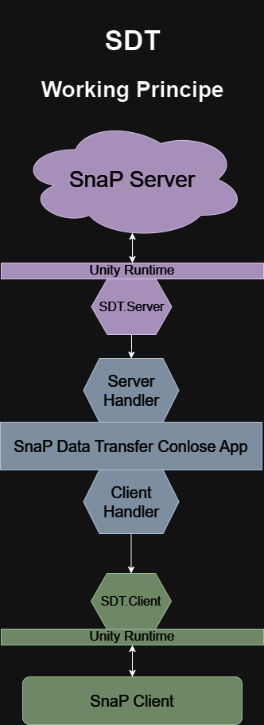

# SDT
SDT - [SnaP](https://github.com/TheActualTwinkle/SnaP) Data Transfer

## What is this?
* Using *TCP/UDP*  we getting data about Game Lobbies from **SnaP** game (as Server/Host)
* Store them 
* Send this data to **SnaP** game  (as Client)

