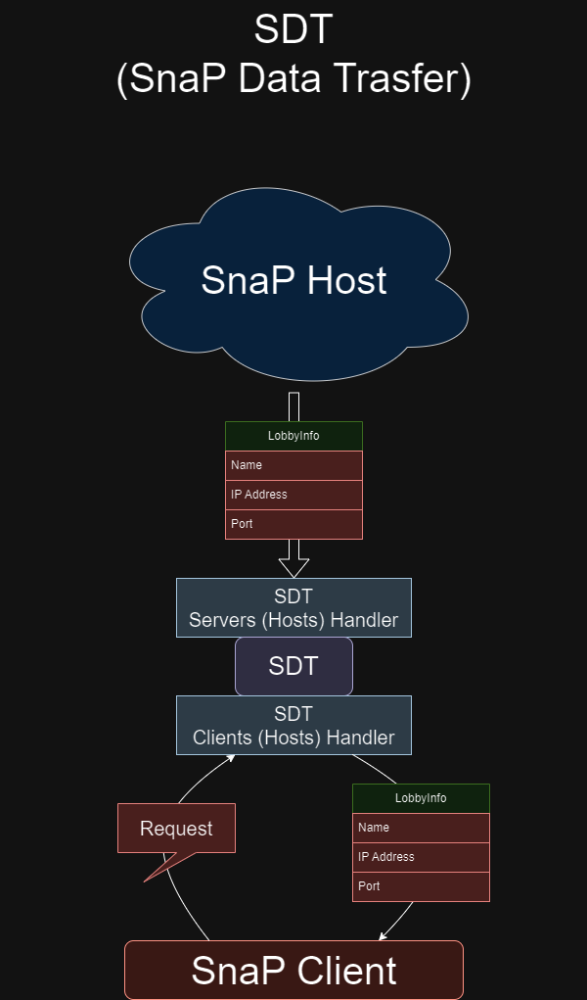

# SDT
SDT - [SnaP](https://github.com/TheActualTwinkle/SnaP) Data Transfer

## What is this?
* Using *TCP*  we getting data about Game Lobbies from **SnaP** Server/Host
* Store them 
* Send this data to **SnaP** Clients

